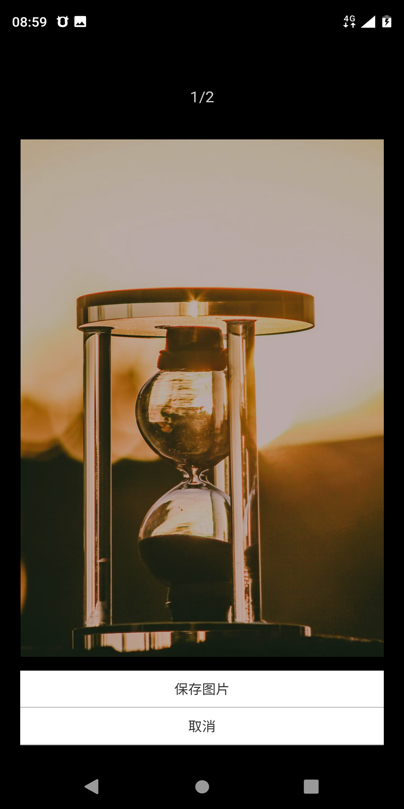

# 壁纸之家

A react native app based on expo, dva, react-native-elements, shoutem UI, etc.

## Getting Started

A react native app based on expo, dva, react-native-elements, shoutem UI, etc. We provided a demo for wallpaper development.
<br/>




<br/>
Get it on <a href='https://play.google.com/store/apps/details?id=top.skysoft.wallpaper'>Google Play</a> or <a href='https://expo.io/@sppsun/wallpaperhome'>Expo</a>


### Prerequisites

```
nodejs
expo
```

### Installing

```
git clone https://github.com/sppsun/wallpaper-app.git
npm install
npm start
```

End with an example of getting some data out of the system or using it for a little demo


## Built With

* [Expo](https://expo.io/tools)

## Authors

* **sppsun** - *Initial work* - [sppsun](https://github.com/sppsun)

## License

This project is licensed under the MIT License - see the [LICENSE.md](LICENSE.md) file for details
